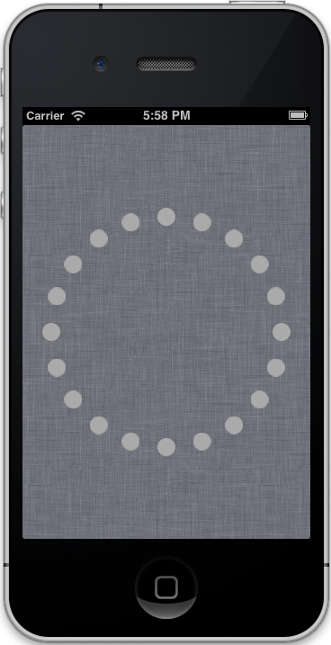

CollectionViewLayouts
=====================

Introduction
------------

`UICollectionViews` got introduced in iOS 6 and ship already with the ready to
use `UICollectionViewLayout`, which is absolutely nice for grid and line layouts.

But there are other, really nice layouts possible with `UICollectionViews`, so
the purpose of this project is:

    1. learn how to build custom layouts

    2. collect all layouts in one place

Circle Layout
-------------

This is Layout is rewritten from Apples WWDC 2012 Seesion "Advanced Collection
Views and Building Custom Layouts"

https://developer.apple.com/videos/wwdc/2012/?include=219

Description
~~~~~~~~~~~

A simple circle layout with an initial cell count of 20 items.

A tap gesture recognizer handles the **add** and **delete** actions.

Tapping on a cell deletes it, tapping on the background adds an item.

Files::

    CircleViewLayout.h
    CircleViewLayout.m

Screenshot
~~~~~~~~~~

Changelog
---------

0.1 - unreleased
~~~~~~~~~~~~~~~~

- implemented circle layout

License
-------

MIT. do what you want.

.. vim: set ft=rst ts=4 sw=4 expandtab tw=78 :
